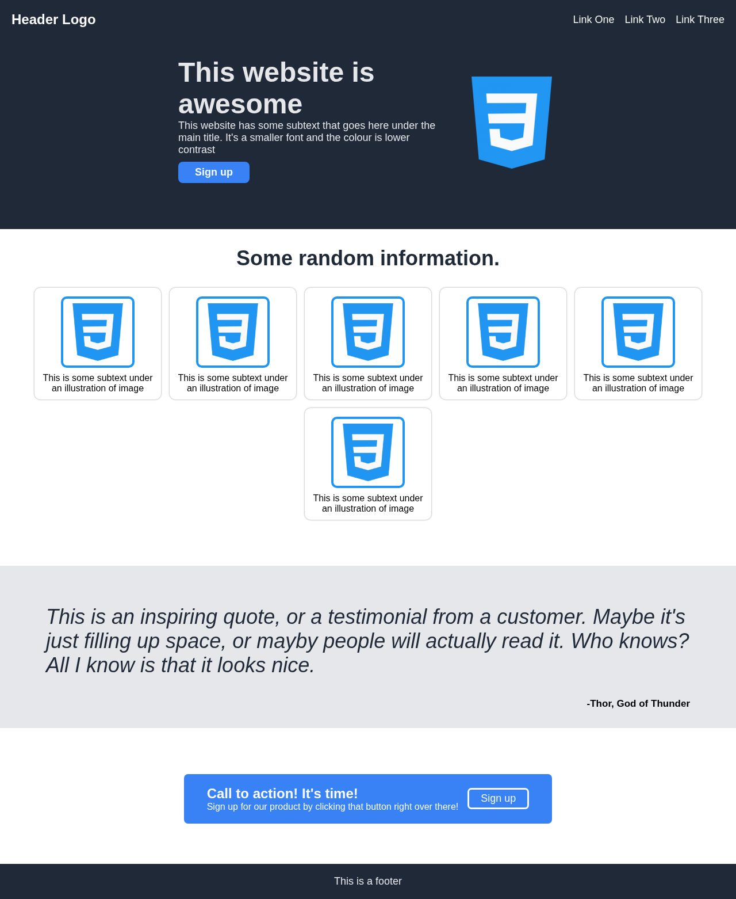

# Landing Page

A sample landing page built to practice HTML and CSS flexbox.

## Overview

A responsive landing page created as a front-end practice project, focusing on flexbox layout techniques and modern CSS.

## Features

- Responsive layout with flexbox
- Clean, modern design
- Mobile-friendly

## Tech Stack

- HTML5, CSS3

## Getting Started

Open `index.html` in a browser. No build step required.

## Project Structure

```
├── index.html             # Landing page
├── style/
│   └── index.css          # Styles
└── css.png                # Reference image
```


## Screenshots


## License

MIT
